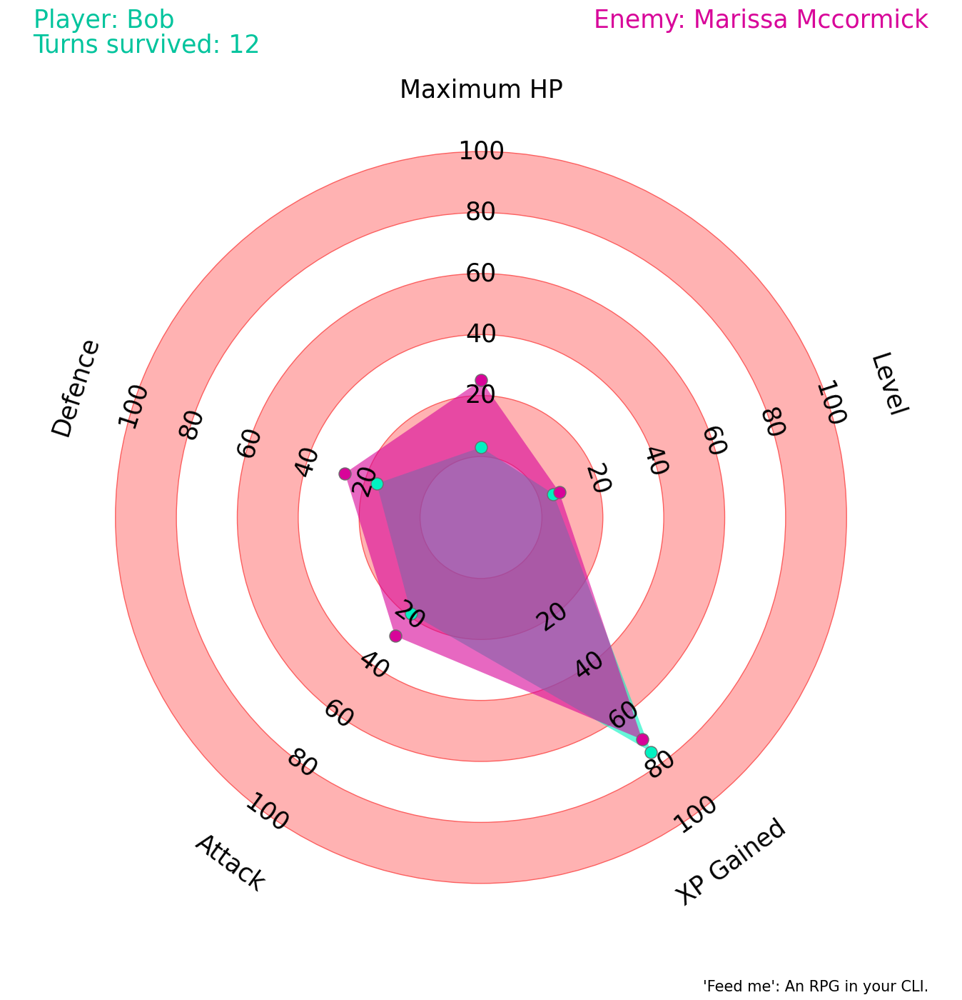

# feedme - CLI RPG

Game details:

- Name your player & duke it out with your chosen enemy
- Every turn, you'll either rest, gain XP or get WHACKED
- Game ends when your player HP is 0
- Both you and enemy stats progressively increase the longer the game goes on

To start:

1. `python3 -m venv .venv`
2. `source .venv/bin/activate`
3. `pip install -r requirements.txt`
4. `pytest -v --junitxml=test-reports/junit.xml`
5. `python game/main.py`

Radar chart:

Whilst playing you'll see a lovely radar chart showing both your & the enemy stats. This chart live updates as the game plays out. See who can reach level 100 first!

> [!IMPORTANT]
> Enemy names are randomly generated each run using Faker library. There are no enemies here, only fun times.

